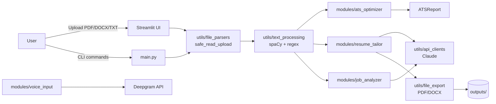

# 🎯 CV Tailor — ATS-Friendly Resume Builder & Tailoring System

> Build, optimise, and tailor resumes that pass Applicant Tracking Systems —
> powered by Claude AI, with a Streamlit UI and a full-featured CLI.

[](https://www.python.org/downloads/)
[](https://streamlit.io)
[](https://www.anthropic.com)
[](#-license)

---

## 📺 Demo

| Walkthrough video | Quick GIF |
| --- | --- |
| [▶ Watch the 90-second demo](https://www.youtube.com/watch?v=DEMO_VIDEO_ID) |  |

> Replace the YouTube URL above with your own once recorded — see
> [docs/screenshots/README.md](docs/screenshots/README.md) for capture
> guidance.

## 🖼️ Screenshots

| Build CV | ATS Score | Tailor |
| :---: | :---: | :---: |
|  |  |  |

| Cover Letter | Templates | CLI |
| :---: | :---: | :---: |
|  |  |  |

> Drop your PNGs into [`docs/screenshots/`](docs/screenshots/) using the
> filenames above and they appear automatically.

---

## ✨ Features

| Feature | Description |
| --- | --- |
| 📝 **Resume Builder** | Build resumes from structured input with optional AI enhancement |
| 🎯 **Resume Tailor** | Rewrite a resume for a target job description with strict no-fabrication rules |
| 📊 **ATS Optimiser** | Score 0–100 across 5 categories (sections, keywords, formatting, bullets, length) plus 16+ granular checks |
| 🔍 **Job Analyser** | Extract required / preferred skills and responsibilities from a JD |
| 🏭 **Industry Intel** | Detect target industry from a JD and surface industry-specific keywords |
| 🎤 **Voice Input** | Speak your experience → structured resume (Deepgram + Claude) |
| ✉️ **Cover Letter** | AI-generated cover letters tailored to a JD |
| 🔗 **LinkedIn Summary** | Generate compelling LinkedIn “About” sections |
| 🌐 **Multilingual** | Translate resumes into 15+ languages |
| 🎨 **3 PDF / DOCX templates** | Minimal, Professional, Modern |
| 🔀 **Resume Diff** | Compare two versions side-by-side |
| 🎤 **Interview Prep** | Generate likely interview questions for a JD + resume |
| 💻 **CLI + Web UI** | Both surfaces share the same engine |

---

## 🧱 Tech Stack

- **Language:** Python 3.10+ (`from __future__ import annotations` style)
- **UI:** Streamlit 1.38+
- **AI:** Anthropic Claude (text), Deepgram (speech-to-text)
- **NLP:** spaCy (`en_core_web_sm`) with regex fallback
- **Documents:** ReportLab (PDF), python-docx (DOCX), pdfplumber (PDF parsing)
- **Validation:** Pydantic + pydantic-settings
- **Resilience:** Tenacity (retries with exponential backoff)
- **Testing:** pytest + pytest-cov

---

## 🏗️ Architecture



---

## 🗂️ Folder Structure

```
cv_maker/
├── main.py                  # CLI entry point (10 subcommands)
├── config.py                # Settings + ATS constants (pydantic-settings)
├── Dockerfile               # Production-ready multi-stage build (non-root)
├── docker-compose.yml       # Single-service compose for local / VPS
├── .dockerignore
├── requirements.txt
├── pyproject.toml           # pytest + coverage config
│
├── app/
│   └── streamlit_app.py     # Streamlit web UI (10 tabs)
│
├── modules/
│   ├── resume_builder.py    # Build a resume from structured input
│   ├── resume_tailor.py     # JD-aware tailoring (Claude or keyword-only)
│   ├── ats_optimizer.py     # ATS scoring + suggestions
│   ├── job_analyzer.py      # JD parsing + gap analysis
│   ├── industry_intel.py    # Industry detection + missing keywords
│   ├── interview_prep.py    # Question generation
│   ├── resume_diff.py       # Version comparison
│   ├── bonus_features.py    # Cover letter, LinkedIn, translation
│   ├── voice_input.py       # Deepgram → Claude pipeline
│   ├── templates.py         # PDF / DOCX templates
│   ├── spell_check.py       # Optional pyspellchecker pass
│   └── models.py            # Pydantic schemas
│
├── utils/
│   ├── api_clients.py       # Claude + Deepgram wrappers (retry + key isolation)
│   ├── text_processing.py   # NLP / keyword extraction
│   ├── file_parsers.py      # PDF/DOCX/TXT/JSON + safe-upload validator
│   ├── file_export.py       # PDF / DOCX generators
│   └── logging_config.py
│
├── docs/screenshots/        # README assets (drop your PNGs here)
├── sample_data/             # Sample resume + JD for testing
├── tests/                   # 18 test files (pytest)
└── outputs/                 # Generated PDFs / DOCX / TXT (gitignored)
```

---

## 🚀 Quick Start

### Option A — Local (Python venv)

```powershell
cd cv_maker
python -m venv .venv
.\.venv\Scripts\Activate.ps1          # macOS/Linux: source .venv/bin/activate
pip install -r requirements.txt
python -m spacy download en_core_web_sm

Copy-Item .env.example .env           # macOS/Linux: cp .env.example .env
# Edit .env and set ANTHROPIC_API_KEY (and DEEPGRAM_API_KEY if using voice)

# Launch the web UI
streamlit run app/streamlit_app.py

# …or use the CLI
python main.py build --json sample_data/sample_resume.json --format pdf
```

### Option B — Docker (recommended for deployment)

```powershell
cd cv_maker

# Build the image (multi-stage; spaCy model is baked in)
docker build -t cv-tailor:latest .

# Run it
docker run --rm -p 8501:8501 `
  -e ANTHROPIC_API_KEY=sk-ant-... `
  -e DEEPGRAM_API_KEY=...           `
  -v cv_tailor_outputs:/app/outputs `
  cv-tailor:latest
```

Open <http://localhost:8501>.

### Option C — Docker Compose

```powershell
# Put ANTHROPIC_API_KEY=... and DEEPGRAM_API_KEY=... in a .env beside docker-compose.yml
docker compose up -d
docker compose logs -f cv-tailor
```

---

## ⚙️ Environment Variables

| Variable | Required | Default | Purpose |
| --- | :---: | --- | --- |
| `ANTHROPIC_API_KEY` | for AI features | — | Claude API key (resume tailoring, cover letter, translation, voice structuring) |
| `DEEPGRAM_API_KEY` | for voice input | — | Deepgram speech-to-text API key |
| `CLAUDE_MODEL` | no | `claude-sonnet-4-20250514` | Claude model identifier |
| `CLAUDE_MAX_TOKENS` | no | `4096` | Max output tokens per Claude call |
| `CLAUDE_TEMPERATURE` | no | `0.4` | Default sampling temperature |
| `LOG_LEVEL` | no | `INFO` | `DEBUG` / `INFO` / `WARNING` / `ERROR` / `CRITICAL` |
| `CV_TAILOR_MAX_UPLOAD_BYTES` | no | `5242880` (5 MB) | Hard cap on uploaded resume size |
| `CV_TAILOR_MAX_PDF_PAGES` | no | `15` | Reject PDFs longer than this |
| `STREAMLIT_SERVER_MAX_UPLOAD_SIZE` | no | `5` (MB) | Streamlit's own upload guard |

> The resume builder, ATS analyser, and the **basic** (no-AI) tailor work
> without any API key. Only AI-backed features (`--enhance`, `tailor` with
> `use_ai=True`, `cover-letter`, `linkedin`, `translate`) call out.

---

## 📋 CLI Reference

```bash
python main.py build         --json data.json [--format pdf|docx|txt] [--template minimal|professional|modern] [--enhance]
python main.py tailor        --resume r.txt --jd jd.txt [--no-ai] [--output path]
python main.py ats           --resume r.txt [--jd jd.txt]
python main.py analyze-jd    --jd jd.txt [--resume r.txt] [--no-ai]
python main.py cover-letter  --resume r.txt --jd jd.txt --company "Acme" [--manager "Name"]
python main.py linkedin      --resume r.txt
python main.py translate     --resume r.txt --language Spanish     # or: --list-languages
python main.py voice         [--audio recording.wav]               # or: --list-devices
python main.py interactive
```

---

## 📊 ATS Scoring

| Component | Points | Measures |
| --- | :---: | --- |
| Section Structure | 25 | Presence of standard sections (Experience, Education, Skills, …) |
| Keyword Optimisation | 25 | Alignment with job description keywords |
| Formatting | 20 | ATS-safe formatting (no tables, images, fancy chars) |
| Bullet Quality | 20 | Action verbs + quantified achievements |
| Resume Length | 10 | Optimal 400–800 words |

**Score bands:** 80–100 ✅ Excellent · 60–79 📊 Good · 40–59 ⚠️ Needs Work · 0–39 ❌ Poor

---

## 🔌 Programmatic API (excerpt)

```python
from modules.ats_optimizer import ATSOptimizer
from modules.resume_tailor import ResumeTailor
from utils.api_clients import set_user_api_key

# Optional: set a per-request key (isolated via ContextVar — no os.environ mutation)
set_user_api_key("sk-ant-...")

# Score a resume
report = ATSOptimizer().analyse(resume_text, job_description=jd_text)
print(report.overall_score, report.suggestions)

# Tailor it
result = ResumeTailor().tailor(resume_text, jd_text, use_ai=True)
print(result["tailored_resume"])
print(result["keyword_report"]["match_rate"], "%")
```

---

## 🧪 Testing

```bash
cd cv_maker
pytest tests/ -v                            # full suite
pytest tests/ -v --cov=modules --cov=utils  # with coverage
pytest tests/test_ats_optimizer.py -v       # single file
```

> Tests that hit Claude/Deepgram are skipped unless `ANTHROPIC_API_KEY` /
> `DEEPGRAM_API_KEY` are set. CI runs the offline subset by default.

---

## 🔐 Security & Privacy

This release of CV Tailor has been hardened against the most common attack
classes for a Streamlit + AI app:

| Hardening | Where |
| --- | --- |
| **Per-session API key isolation** — keys entered in the UI live in `st.session_state` + a `ContextVar`; they are **never** written to `os.environ` (no cross-user leakage). | [`utils/api_clients.py`](utils/api_clients.py), [`app/streamlit_app.py`](app/streamlit_app.py) |
| **Prompt-injection fencing** — every user-supplied resume / JD / spoken text is wrapped in a per-request random-nonce fence with a protective system instruction. | [`utils/api_clients.py`](utils/api_clients.py) `_fence(...)` |
| **Upload validation** — size cap (5 MB by default), magic-byte sniffing, page-count cap on PDFs, and explicit rejection of legacy `.doc`. | [`utils/file_parsers.py`](utils/file_parsers.py) `safe_read_upload(...)` |
| **In-memory PDF parsing** — uploads are no longer written to disk via `NamedTemporaryFile(delete=False)`. Voice recordings are deleted in a `finally` block after structuring. | [`utils/file_parsers.py`](utils/file_parsers.py), [`modules/voice_input.py`](modules/voice_input.py) |
| **HTML escaping** — every value that originates from a parsed resume is run through `html.escape` before being rendered into an `unsafe_allow_html` block. | [`app/streamlit_app.py`](app/streamlit_app.py) `_h(...)`, `_skill_tags(...)`, `_metric(...)` |
| **Streamlit XSRF protection** | Enabled by default in the Dockerfile (`STREAMLIT_SERVER_ENABLE_XSRF_PROTECTION=true`). |
| **Non-root container** | Dockerfile runs as UID 10001 with no shell. |
| **No-fabrication AI rules** | Every Claude prompt explicitly forbids inventing experience, skills, dates, or metrics. |

### Known limitations (still on the roadmap)

- No built-in **authentication or per-user rate limiting** — deploy behind an
  authenticated reverse proxy if exposed publicly.
- No **token-spend cap** — set one at your Anthropic dashboard.
- Generated files in `outputs/` are **kept indefinitely** — add a cron / job to
  purge older artefacts, or mount `outputs/` to a volume with a TTL.

To report a security issue, please email **security@your-domain.example**
rather than opening a public issue.

---

## 🚢 Deployment

### Local single-user
```bash
streamlit run app/streamlit_app.py
```

### Single-tenant VPS (Docker + Caddy)

```Caddyfile
cv-tailor.example.com {
    encode zstd gzip
    header {
        Strict-Transport-Security "max-age=31536000; includeSubDomains; preload"
        X-Frame-Options "DENY"
        X-Content-Type-Options "nosniff"
        Referrer-Policy "strict-origin-when-cross-origin"
        Content-Security-Policy "default-src 'self'; style-src 'self' 'unsafe-inline'; img-src 'self' data:; connect-src 'self'"
    }
    reverse_proxy app:8501
}
```

```bash
docker compose up -d
```

### Production checklist

- [ ] Set `ANTHROPIC_API_KEY` and `DEEPGRAM_API_KEY` via the orchestrator's
      secret store (never bake into image).
- [ ] Front the container with HTTPS + HSTS (Caddy / Nginx / Cloudflare).
- [ ] Enable an external rate limiter (Cloudflare WAF, Nginx `limit_req`).
- [ ] Configure log shipping (`LOG_LEVEL=INFO`, ship stdout to your aggregator).
- [ ] Add Sentry (or equivalent) for error tracking.
- [ ] Schedule a daily cleanup job for `outputs/` (and audio temp files if voice
      is enabled).
- [ ] Monitor `/_stcore/health`.
- [ ] Pin dependency versions with `pip-compile` and run `pip-audit` weekly.

---

## 🤝 Contributing

1. Fork the repo and create a feature branch (`git checkout -b feat/my-thing`).
2. Run the test suite (`pytest tests/ -v`).
3. Keep diffs focused and write a clear PR description.
4. By submitting a PR you agree to license your contribution under the
   project's MIT license.

Conventions:
- Code style: PEP 8 + 100-char lines.
- Type hints required for new public functions.
- New AI prompts MUST embed user content via `utils.api_clients._fence(...)`.

---

## 📄 License

MIT License — use freely for personal and commercial projects.
